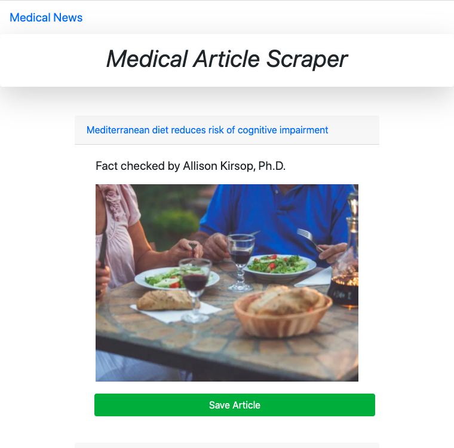
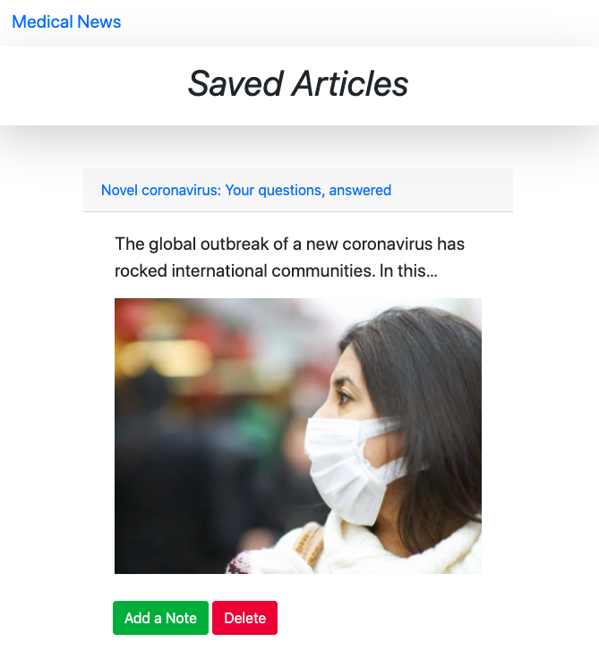
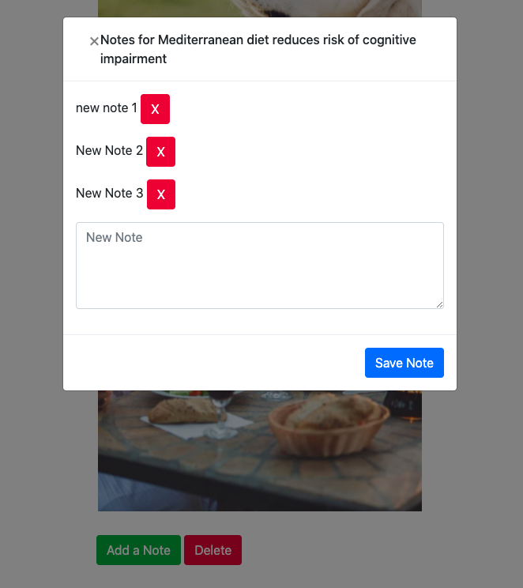
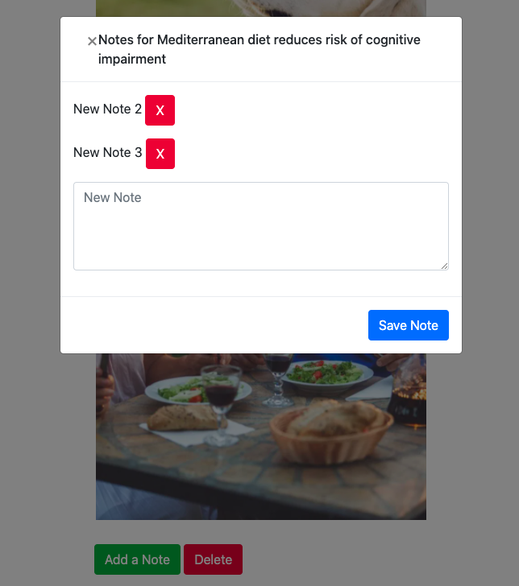

# Week-18. News-Scrap
## Medical News 

### OverView
Created a web application that allows users to view and leave comments regarding the latest news. I used Mongoose and Cheerio to scrape news from the Medical [news today](https://www.medicalnewstoday.com/) website. 

### How It Works

Once articles are loaded, user can read the articles:
* Headline - the title of the article
* Summary - a short summary of the article
* URL - the url to the original article
* Photos - the url to the original article

Users be able to leave comments on the articles displayed and revisit them later.           
The comments be saved to the database as well and associated with their articles.
Users also be able to delete comments left on articles. 
All stored comments visible to every user.

#### [Click to Try This App!](https://news-app2020.herokuapp.com)

### Technologies Used

* Node.js
* Express.js
* Handlebars.js
* MongoDB
* Mongoose
